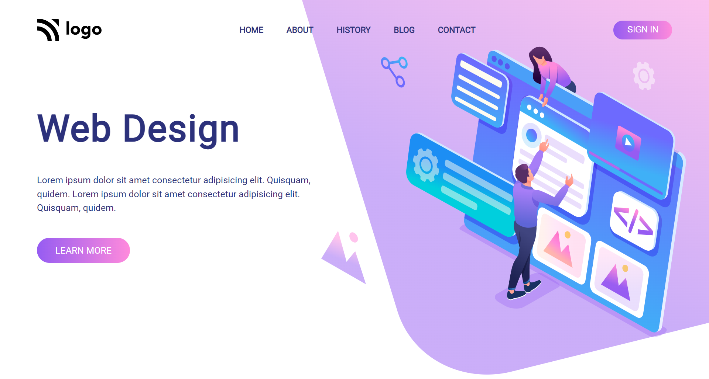

## PROJECT NAME: Web Design Landing Page

### **💻TECH STACK USED IN THIS PROJECT:** 
- 
- 

### **🛠WHAT I HAVE LEARNT IN THIS PROJECT:** 
- Media Queries
- Setting the background image
- Linear gradient
- overflow property
- Positions(relative,absolute)
- designing Buttons 
- Padding
- CSS Selectors
- CSS Flex-box

### **⌛TIME TAKEN TO COMPLETE THIS PROJECT:** 
- I have taken 2 hours to complete this project.

### **👀SCREEN CAPTURE IN LAPTOP SCREEN:**

### **👀SCREEN CAPTURE IN MOBILE SCREEN:**

### 💻📱I have made this project responsive in both **laptop** screen and **mobile** screen

### **🚀LIVE LINK:**
-  This project is hosted on **Netlify**.You can Check it live using below link: 
-  [Project Live Link !](https://631d8a727bc20869b6cd714c--chimerical-granita-073a2d.netlify.app/)

